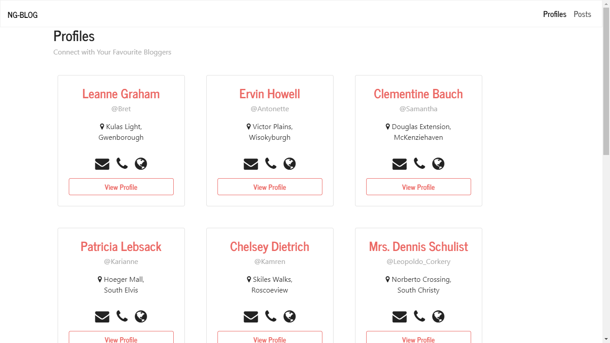
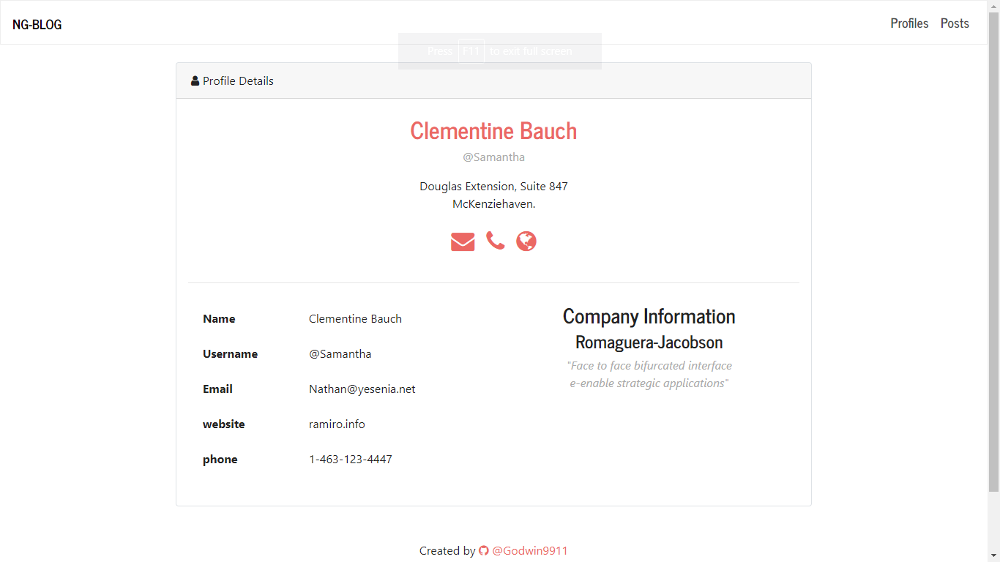
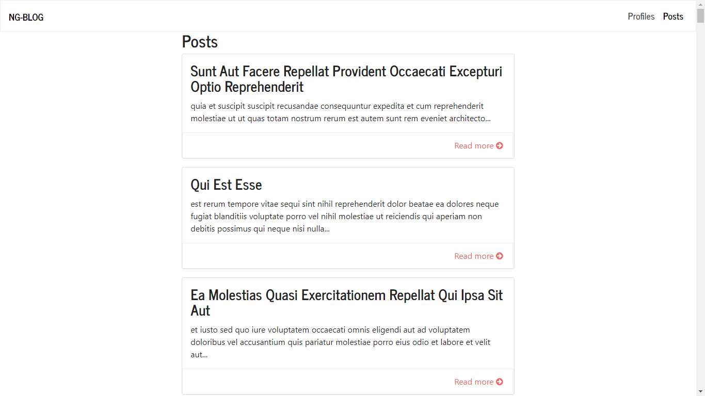
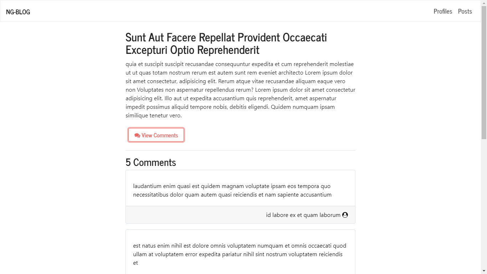

# NgBlog

A Blog Application that consumes data from the Json placeholder API.

## What I Learnt/did

* GET Request to get users, posts and comments from Json placeholder API using Angular's http Client.
* Used Route resolvers to prevent partial loading of users detail and post detail page.
* ScrollPositonRestoration set to enabled, allow page to scroll to top on each route navigation

## Screenshots
### Profile Component

### Profile Detail Component

### Post Component

### Post Detail Component

## Side Info

Null

